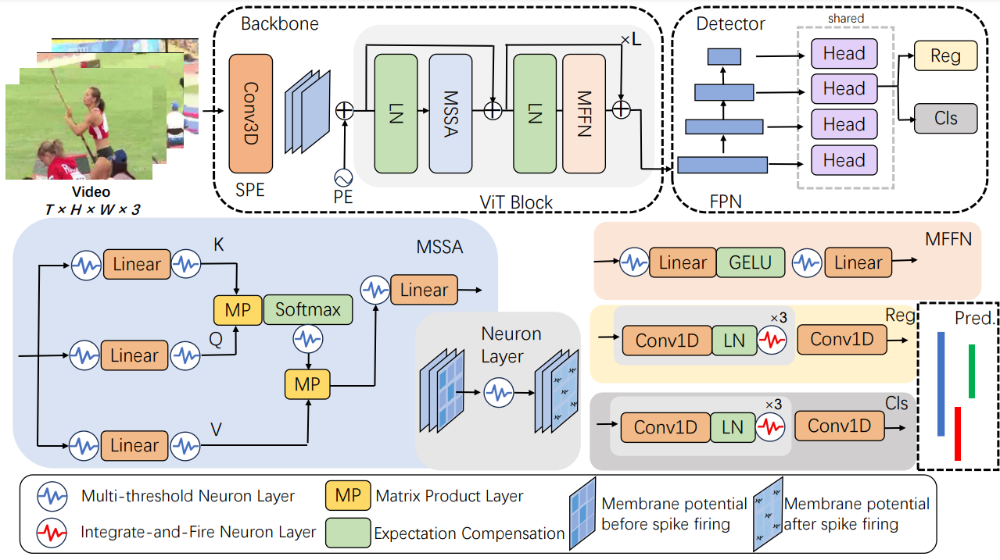

# News
[2026.3.30] Training code featuring ANN-to-SNN conversion capabilities is now available. <br>

[2026.3.27] The SNN models of SpikeTAD for THUMOS14 and ActivityNet-1.3 is updated. Code for training will be updated soon.<br>

# Overview



# Environment preparation

**1:  Create environment**

```
conda env create -f environment.yml
```

**2:  Activate environment**

```
conda activate spiketad
```

# Data preparation

**1:  Download videos**

For **THUMOS14**, please check ./tools/prepare_data/thumos for downloading videos.

Supposing these videos are in the following path:

```
data
└── raw_data
	└── video
		├── training
			├── video_validation_0000051.mp4
			└── .....
		└── validation
			├── video_test_0000004.mp4
			└── .....
```

For **ActivityNet-1.3**, please check ./tools/prepare_data/activitynet for downloading videos.

Supposing these videos are in the following path:

```
data
└── anet
     └── anet_1.3_video_val
     	 ├── NjTk2naIaac.avi
     	 └── .....
```

**3:  Prepare checkpoint weights**

We adopt pre-trained model ViT-S from  [VideoMAE v2](https://https://github.com/OpenGVLab/VideoMAEv2).

You can download SNN checkpoints for SpikeTAD from Google Drive [link](https://drive.google.com/drive/folders/1EjTisCl2Q0Wim8FFJXTP-KX7wETzpwZi?usp=drive_link).

# How to use

Please run the following commad for inference. Tips: It requires 4 GPUs with at least 32GB of VRAM each.

For **THUMOS14**,

``` 
bash scripts/spiketad_thumos.sh
```

For **ActivityNet-1.3**,

``` 
bash scripts/spiketad_anet.sh
```

Please run the following command to execute the complete training and inference pipeline on THUMOS-14.

```
bash scripts/spiketad_thumos_train.sh
```

# Credits

We especially thank the contributors of the  [OpenTAD](https://github.com/sming256/OpenTAD) for providing helpful code.